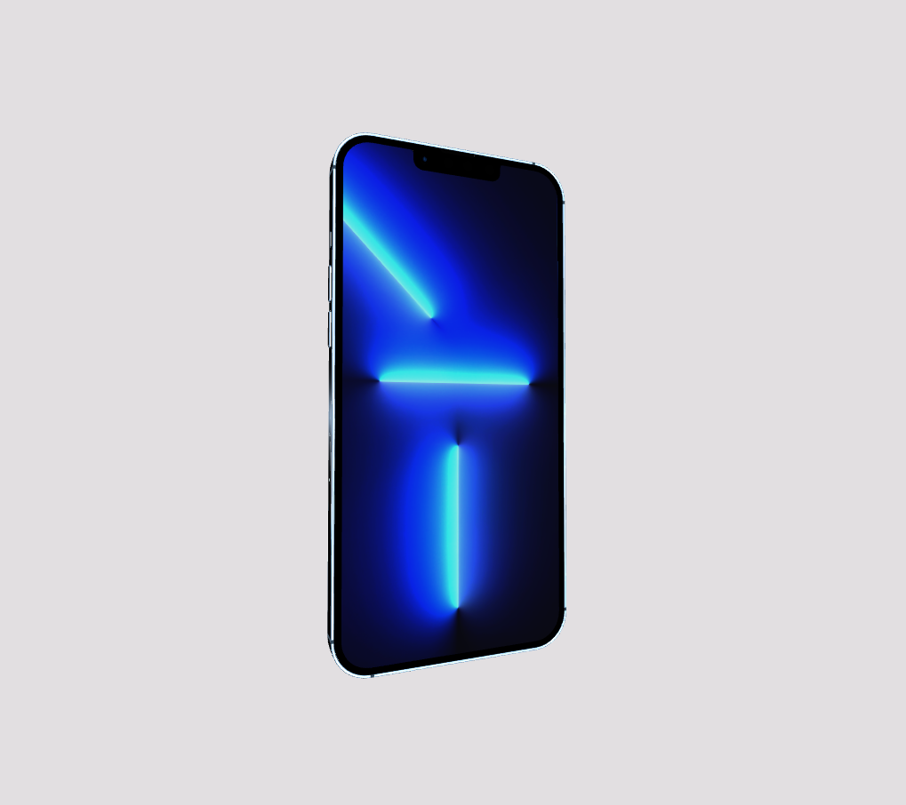

# Информация о репозетории



Чтобы код запустился и работал нужен локальный сервер. Для этого вы можите использовать плагин LiveServer из VSCode. 

> Код из видео немного изменился.

```html
 <script type="importmap">
        {
            "imports": {
                "three": "https://unpkg.com/three@0.139.0/build/three.module.js",
                "OrbitControls": "https://unpkg.com/three@0.139.0/examples/jsm/controls/OrbitControls.js",
                "GLTFLoader": "https://unpkg.com/three@0.139.0/examples/jsm/loaders/GLTFLoader.js",
                "RectAreaLightHelper": "https://unpkg.com/three@0.139.0/examples/jsm/helpers/RectAreaLightHelper.js",
                "RectAreaLightUniformsLib": "https://unpkg.com/three@0.139.0/examples/jsm/lights/RectAreaLightUniformsLib.js"
            }
        }
    </script>
```
Так в html мы подгружаем файлы с облака. Затем в JS импортируем:

```js

import * as THREE from 'three';
import { OrbitControls } from 'OrbitControls';
import { GLTFLoader } from 'GLTFLoader';
import { RectAreaLightHelper } from 'RectAreaLightHelper'
import { RectAreaLightUniformsLib } from 'RectAreaLightUniformsLib';
```
Глобальных изменений не произошло. Я изменил только импорты и свет. Для света я использовал RectAreaLight. В стоке он плохо светит и можно сказать не освещает модель совесем, поэтому подгружаем из three js - RectAreaLightUniformsLib. Для его работы нужно всего лишь его инициализировать:
```js
RectAreaLightUniformsLib.init();
```
